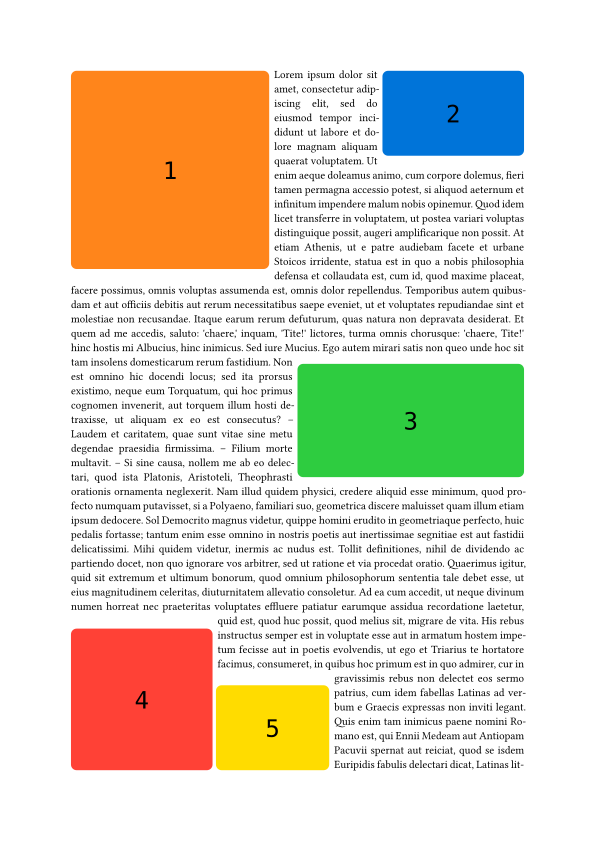
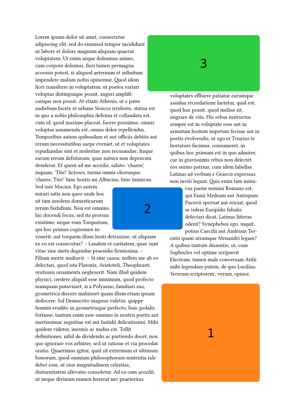

# Meander
_Text threading and image wrap-around for Typst._

`meander` provides a core function `reflow` to segment a page and wrap content around images.

See the [documentation](https://github.com/Vanille-N/meander.typ/tree/v0.2.0/docs/main.pdf).

## Quick start

The function `meander.reflow` splits the input sequence into
- obstacles: all objects created via the function `placed` (which is like `place`),
- containers: produced by `container`, optionally specifying an alignment and dimensions,
- flowing content: produced by `content`.

```typ
#import "@preview/meander:0.2.0"

#meander.reflow({
  import meander: *

  placed(top + left, my-img-1)
  placed(top + right, my-img-2)
  placed(horizon + right, my-img-3)
  placed(bottom + left, my-img-4)
  placed(bottom + left, dx: 35%, my-img-5)

  container()
  content[
    #set par(justify: true)
    #lorem(600)
  ]
})
```


-----

Use multiple `container`s to produce layouts in columns.

```typ
#import "@preview/meander:0.2.0"

#meander.reflow({
  import meander: *

  placed(bottom + right, my-img-1)
  placed(center + horizon, my-img-2)
  placed(top + right, my-img-3)

  container(width: 55%)
  container(align: right, width: 40%)
  content[#lorem(600)]
})
```


------

Meander allows precise control over the boundaries of obstacles, to draw complex paragraph shapes.

```typ
#meander.reflow({
  import meander: *

  placed(
    center + horizon,
    boundary:
      // Override the default margin
      contour.margin(4pt) +
      // Then redraw the shape as a grid
      contour.grid(
        // 25 vertical and horizontal subdivisions (choose whatever looks good)
        div: 25,
        // Equation for a circle of center (0.5, 0.5) and radius 0.5
        (x, y) => calc.pow(2 * x - 1, 2) + calc.pow(2 * y - 1, 2) <= 1
      ),
    // Underlying object
    circle(radius: 1.5cm, fill: yellow),
  )

  container(width: 48%)
  container(align: right, width: 48%)
  content[
    #set par(justify: true)
    #lorem(600)
  ]
})
```

